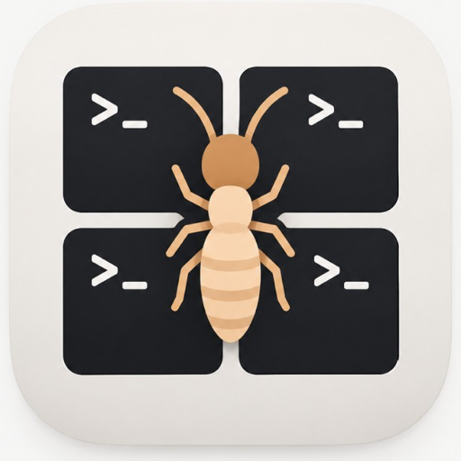

<p align="center">
  
</p>

<h1 align="center">Termie</h1>

<p align="center">
  Several real terminals, one window.
</p>

Termie is a native macOS app for keeping a handful of shells in view at the same time. It is meant for running more than one [Claude Code](https://code.claude.com) session: each tile keeps a name, tiles that are still working stay quiet, and the one that needs you is marked.

Each tile is your login shell, with the same PATH, colors, mouse, and clipboard you get in Terminal, VS Code, or Cursor.

## Install

You need macOS 26 and Xcode 26 or newer.

```sh
git clone https://github.com/virbedi/termie.git
cd termie
xcodebuild -project Termie.xcodeproj -scheme Termie -destination 'platform=macOS' -derivedDataPath build -skipPackagePluginValidation build
open build/Build/Products/Debug/Termie.app
```

No Apple Developer account is required. The project builds ad hoc. Termie is not sandboxed, so the shell can see your files, Homebrew, and the rest of your tools. The first window opens your login shell in your home folder.

## Use it

A new window starts with one terminal. Add another with **⌘T**, or the **+** button. **⌘W** closes the one you are typing in.

Drag the grip in the gap between tiles to resize them. Two tiles split the window. Three give a large tile beside a stack. Four make a cross. The sizes stick until you add or close a session.

Claude names its iTerm tabs on its own. Termie reads that same title, so a tile called “fix auth” is the session doing that work. Double-click a name to pin your own, and choose **Use Terminal Title** when you want Claude’s name back.

| | |
| --- | --- |
| **Working** | The session is still printing, or Claude’s progress indicator is running. |
| **Needs you** | Claude rang the bell, sent a notification, or finished and is waiting. The tile gets an orange edge and the large cell, the Dock badge updates, and you get a notification if Termie is in the background. Focus the tile to clear it. |
| **Idle** | The shell is sitting quietly and has not asked for you. |

**⌘]** and **⌘[** move between tiles. **⌘1** through **⌘9** jump to a tile. **⌘⇧R** restarts the focused shell. The menu bar icon lists every session, with the ones that need you called out.

### Settings

Open Settings to change:

- **Shell.** Leave this empty to use your login shell. New terminals are login shells, so `.zprofile` and `.zshrc` still run.
- **Starting folder.** New terminals open in the focused session’s directory, or in a folder you choose.
- **Font size**, and **Option as Esc**, which Claude Code shortcuts expect.
- **iTerm channel.** On by default, so Claude sends the same titles and “needs you” pings it sends iTerm. Changing this applies to terminals you open afterward.
- **Beep** when a tile needs you.

## For contributors

```sh
swift test --package-path Packages/TermieCore
```

`Termie/` is the app. `Packages/TermieCore` holds title, attention, layout, and resize logic, with tests. Read [CONTRIBUTING.md](CONTRIBUTING.md) before changing those.

## Credits

- Window, settings, about box, and menu bar started from [swift-macos-template](https://github.com/simonweniger/swift-macos-template) by Simon Weniger (MIT).
- Terminal emulation is [SwiftTerm](https://github.com/migueldeicaza/SwiftTerm) by Miguel de Icaza and contributors (MIT).

## License

[MIT](LICENSE). Copyright (c) 2026 Vir Bedi. Copyright (c) 2023 Simon Weniger remains on the template.
