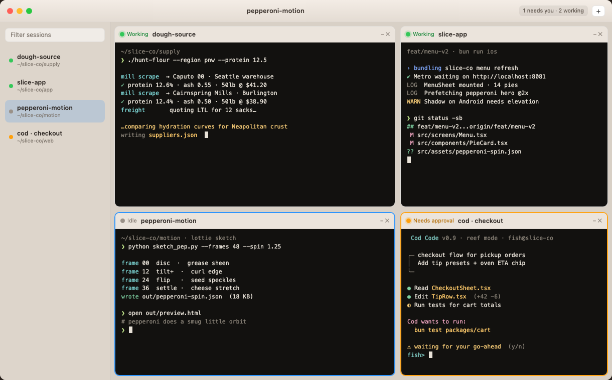

<p align="center">
  
</p>

<h1 align="center">Termie</h1>

<p align="center">
  <strong>One window for your simulators, servers, and AI agents.</strong>
</p>

<p align="center">
  Native macOS app for side-by-side login shells—named tiles, attention when a session needs you, and the shell you already use.
</p>

<p align="center">
  
</p>

## Install

Requires **macOS 26** and **Xcode 26+**. Build from source:

```sh
git clone https://github.com/virbedi/termie.git
cd termie
xcodebuild -project Termie.xcodeproj -scheme Termie -destination 'platform=macOS' -derivedDataPath build -skipPackagePluginValidation build
open build/Build/Products/Debug/Termie.app
```

## Shortcuts

| Shortcut | Action |
| --- | --- |
| **⌘T** | New terminal |
| **⌘W** | Close focused terminal |
| **⌘⇧M** | Minimize focused terminal |
| **⌘]** / **⌘[** | Next / previous |
| **⌘1–9** | Jump to a tile |

Drag the grip between tiles to resize. The menu bar icon lists every session.

## Claude Code

For [Claude Code](https://code.claude.com) waits to ping Termie, set this in `~/.claude/settings.json`:

```json
{
  "preferredNotifChannel": "terminal_bell"
}
```

## License

[MIT](LICENSE) · [SwiftTerm](https://github.com/migueldeicaza/SwiftTerm) · [swift-macos-template](https://github.com/simonweniger/swift-macos-template) · [Contributing](CONTRIBUTING.md)
